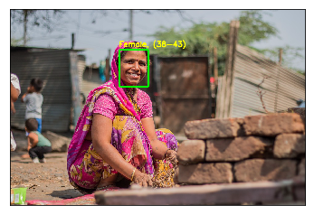

```python
#!pip install matplotlib 
```

    Requirement already satisfied: matplotlib in c:\users\statssy\anaconda3\lib\site-packages
    Requirement already satisfied: numpy>=1.7.1 in c:\users\statssy\anaconda3\lib\site-packages (from matplotlib)
    Requirement already satisfied: six>=1.10 in c:\users\statssy\anaconda3\lib\site-packages (from matplotlib)
    Requirement already satisfied: python-dateutil>=2.0 in c:\users\statssy\anaconda3\lib\site-packages (from matplotlib)
    Requirement already satisfied: pytz in c:\users\statssy\anaconda3\lib\site-packages (from matplotlib)
    Requirement already satisfied: cycler>=0.10 in c:\users\statssy\anaconda3\lib\site-packages (from matplotlib)
    Requirement already satisfied: pyparsing!=2.0.4,!=2.1.2,!=2.1.6,>=2.0.1 in c:\users\statssy\anaconda3\lib\site-packages (from matplotlib)
    

    You are using pip version 9.0.1, however version 20.0.2 is available.
    You should consider upgrading via the 'python -m pip install --upgrade pip' command.
    


```python
# !pip install open-python
```

    Collecting open-python
    

      Could not find a version that satisfies the requirement open-python (from versions: )
    No matching distribution found for open-python
    You are using pip version 9.0.1, however version 20.0.2 is available.
    You should consider upgrading via the 'python -m pip install --upgrade pip' command.
    


```python
%run gad.py --image woman1.jpg
```

    Gender: Female
    Age: 38-43 years
    




